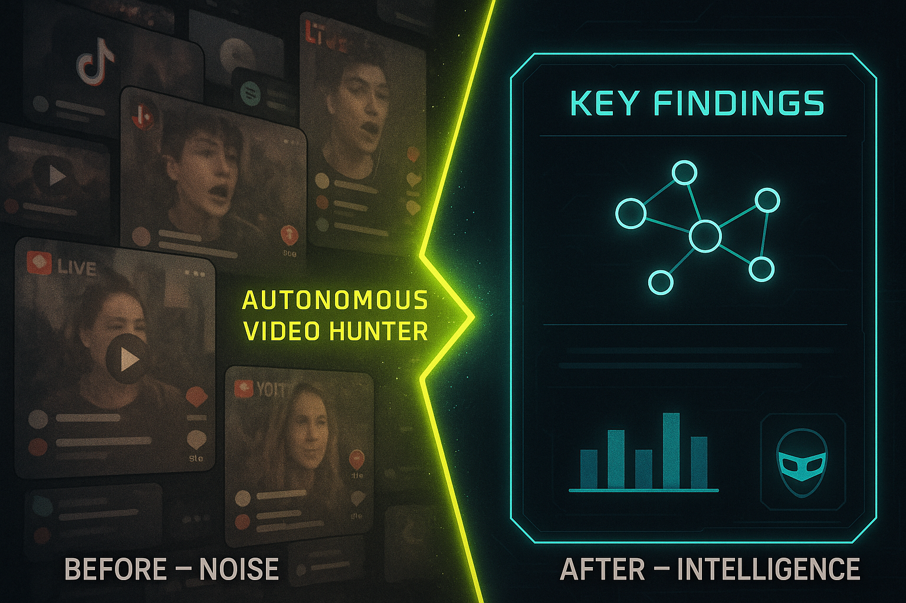
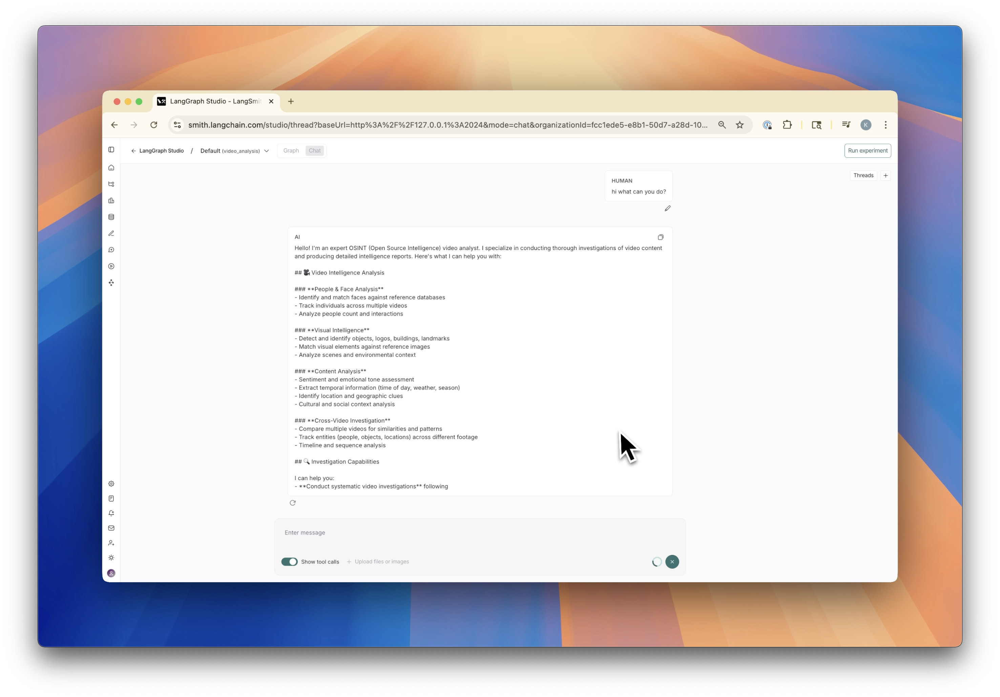
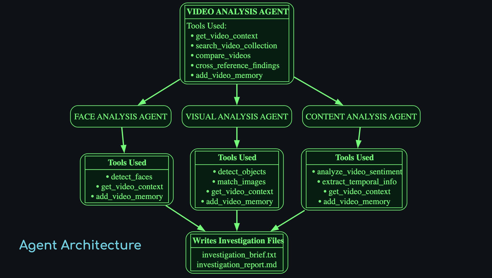

# Autonomous Video Hunter



A proof-of-concept (POC) OSINT (Open Source Intelligence) video analysis system built with LangGraph. This implementation demonstrates how deep research agents can be used for automated video analysis, including face detection, object recognition, image matching, sentiment analysis, and cross-video correlation for intelligence gathering use cases.




## About This POC

This project serves as a demonstration of:
- **Multi-agent video analysis workflows** using LangGraph's agent orchestration
- **Specialized sub-agents** for domain-specific analysis (faces, objects, content)
- **Integration patterns** for combining computer vision, AI, and intelligence analysis
- **OSINT methodologies** applied to video content through automated agents
- **Scalable architecture** for processing and analyzing large video collections

The codebase is designed to showcase techniques and patterns rather than provide a production-ready system.

## POC Scope and Limitations

**What This POC Demonstrates:**
- Multi-agent orchestration using LangGraph for complex video analysis workflows
- Integration patterns between AI services (Cloudglue), computer vision (OpenCV), and deep learning models
- Structured approach to OSINT video analysis with confidence scoring and evidence collection
- Extensible architecture for adding new analysis capabilities and specialized agents

**What a Production System Would Additionally Need:**
- Robust error handling and recovery mechanisms
- Scalable video processing infrastructure
- User authentication and access controls
- Advanced caching and optimization strategies  
- Comprehensive logging and monitoring
- Data privacy and retention policies
- Performance optimization for large-scale deployments

An additional limitation not covered by this repo is the scraping infrastructure for collecting videos at scale from target public sources, but a POC for how to gather videos from social sources like TikTok (as shown in the Recon Village @ DEF CON 33 talk) is provided here: [Gumloop Social Media Intelligence Listener / TikTok Scraper Template](https://www.gumloop.com/pipeline?workbook_id=sQvgaRb9Q81nCwBCwipHub)

## Features

### Core Video Analysis
- **Face Detection & Matching**: Identify and match faces against reference databases
- **Object Detection**: Zero-shot detection of any specified objects using state-of-the-art models
- **Image Matching**: RANSAC-based matching for buildings, logos, and visual elements
- **Content Analysis**: Sentiment analysis, temporal information extraction, and contextual intelligence

### Intelligence Capabilities
- **Cross-Video Analysis**: Compare and correlate findings across multiple videos
- **Memory System**: Persistent storage of investigation findings and notes
- **Temporal Analysis**: Extract time-of-day, weather, seasonal, and location indicators
- **Evidence Management**: Automatic confidence scoring and evidence documentation

### Multi-Agent Architecture
- **Specialized Sub-Agents**: Domain experts for face analysis, visual analysis, and content analysis
- **Coordinated Investigation**: Systematic approach following OSINT best practices
- **Comprehensive Reporting**: Detailed intelligence reports with confidence assessments



## Prerequisites

- Python 3.12+
- FFmpeg (for video processing)
- Cloudglue API account
- Anthropic API key (for Claude)

## Installation

1. **Clone the repository**
   ```bash
   git clone https://github.com/your-username/autonomous-video-hunter.git
   cd autonomous-video-hunter
   ```

2. **Install dependencies**
   
   ```bash
   pip install -r requirements-core.txt
   ```

3. **Install system dependencies**
   
   **macOS:**
   ```bash
   brew install ffmpeg
   ```
   
   **Ubuntu/Debian:**
   ```bash
   sudo apt update
   sudo apt install ffmpeg
   ```

4. **Set up environment variables**
   ```bash
   cp .env.sample .env
   ```
   
   Edit `.env` and add your API keys:
   ```
   CLOUDGLUE_API_KEY=your_cloudglue_api_key_here
   ANTHROPIC_API_KEY=your_anthropic_api_key_here
   VIDEO_CONTEXT_DB_PATH=db.jsonl
   ```

## Configuration

### API Keys Required

- **Cloudglue API**: For video understanding and processing
  - Sign up at [cloudglue.dev](https://cloudglue.dev)
  - Used for dense multimodal video description & transcription, scene analysis, and content extraction

- **Anthropic API**: For the underlying Claude LLM
  - Get your key from [console.anthropic.com](https://console.anthropic.com/)
  - Powers the agent reasoning and analysis

- **LangSmith API** (Optional): For monitoring and tracing
  - Get your key from [smith.langchain.com](https://smith.langchain.com/)
  - Enables detailed execution tracing and debugging

### Video Context Database

The system uses a JSONL file to store processed video context data. Each line contains a complete video analysis record including:

- Video metadata and Cloudglue URI
- Extracted frame thumbnails with timestamps  
- AI-generated descriptions and summaries
- Boolean flags for content features (faces, logos, speech, etc.)
- Investigation memories and notes

Configure the database path with:
```bash
export VIDEO_CONTEXT_DB_PATH="/path/to/your/video-database.jsonl"
```

If not set, defaults to `db.jsonl` in the current directory.

**Creating a Video Database:**
```python
from video_processor import VideoProcessor

processor = VideoProcessor(
    media_dir="./media",
    db_path="./my-videos.jsonl",
    api_key="your-cloudglue-key"
)

# Process a video and save to database
result = processor.process("/path/to/video.mp4", save_to_db=True)
```

## Usage

### Running the Development Server

Start the LangGraph development server:

```bash
langgraph dev
```

This will:
- Start the development server on `http://localhost:8123`
- Provide a web interface for interacting with the video analysis agent
- Enable hot reloading during development
- Offer debugging and monitoring capabilities

### Using the Video Analysis Agent

The system is designed around investigation workflows:

1. **Start an Investigation**: Define your investigation question or target
2. **Load Video Context**: Videos should be pre-processed and available in the context database
3. **Run Analysis**: The agent will coordinate specialized sub-agents for comprehensive analysis
4. **Review Results**: Get detailed intelligence reports with confidence assessments

### Example Investigation Workflow

```python
# Example of what the agent can investigate:
# - "Analyze this protest video for key participants"
# - "Find all Starbucks logos across these surveillance videos"
# - "Identify occurences of this person <path to face image> in these social media videos"
# - "Extract temporal and location clues from these outdoor videos"
```

### Video Processing Pipeline

Before analysis, videos need to be processed:

1. **Video Upload**: Upload video to Cloudglue
2. **Frame Extraction**: Extract uniform thumbnail samples
3. **Content Analysis**: Run Cloudglue analysis for transcription and scene understanding
4. **Database Storage**: Store results in JSONL context database

### Available Analysis Tools

#### Face Analysis
- `detect_faces_in_video()`: Match faces against reference databases
- Confidence scoring and temporal tracking
- Automatic face cropping and storage

#### Visual Analysis
- `detect_objects_in_video()`: Zero-shot object detection
- `match_images_in_video()`: RANSAC-based image matching
- Building, logo, and landmark identification

#### Content Analysis
- `analyze_video_sentiment()`: Emotional tone analysis
- `extract_temporal_info()`: Time, weather, and location clues
- Cross-video comparison and correlation

## Project Structure

```
autonomous-video-hunter/
├── video_analysis_agent.py      # Main LangGraph agent definition
├── video_analysis_tools.py      # Core analysis tools and functions
├── video_context.py             # Video context database management
├── video_processor.py           # Video processing pipeline
├── video_understander.py        # Cloudglue integration wrapper
├── video_helper.py              # Video download and frame extraction
├── face_matcher.py              # Face detection and matching
├── image_matcher.py             # RANSAC-based image matching
├── zeroshot_detect.py           # Zero-shot object detection
├── requirements.txt             # Python dependencies
├── langgraph.json              # LangGraph configuration
└── .env.sample                 # Environment variables template
```

## Development

### Adding New Analysis Capabilities

1. Create new analysis functions in `video_analysis_tools.py`
2. Add tools to the agent in `video_analysis_agent.py`
3. Update sub-agents if needed for specialized analysis
4. Test with `langgraph dev`

### Extending Sub-Agents

The system uses specialized sub-agents:
- **face-analysis-agent**: Face detection and people identification
- **visual-analysis-agent**: Object, logo, and visual scene analysis  
- **content-analysis-agent**: Sentiment, temporal, and contextual analysis

### Database Schema

Video contexts are stored as JSONL with this schema:
```json
{
  "local_video_path": "/path/to/video.mp4",
  "cloudglue_uri": "cg://...",
  "local_frames": [...],
  "description": "Markdown description",
  "has_logo": true,
  "logos": ["Starbucks"],
  "has_face": true,
  "has_speech": true,
  "is_outdoors": false,
  "has_text_on_screen": true,
  "duration_seconds": 30.5
}
```

## Security Considerations

- **API Keys**: Never commit API keys to version control
- **Video Data**: Consider data retention policies for processed videos
- **Privacy**: Be aware of privacy implications when analyzing videos with people
- **Compliance**: Ensure compliance with local laws regarding video analysis

## OSINT Ethics

This tool is designed for legitimate intelligence gathering purposes. Users should:
- Respect privacy and consent
- Follow applicable laws and regulations
- Use responsibly for security, journalism, or research purposes
- Consider the ethical implications of automated video analysis

## Troubleshooting

### Common Issues

1. **FFmpeg not found**
   - Install FFmpeg using your system package manager
   - Ensure it's in your PATH

2. **Cloudglue API errors**
   - Verify your API key is correct
   - Check your account has sufficient credits
   - Ensure network connectivity

3. **Face detection issues**
   - Install required face recognition models
   - Check reference image quality
   - Verify image paths are correct

4. **Memory issues with large videos**
   - Consider video compression before processing
   - Adjust frame extraction parameters
   - Monitor system resources

### Debugging

Use LangSmith for detailed execution tracing:
```bash
export LANGCHAIN_TRACING_V2=true
export LANGCHAIN_API_KEY=your_langsmith_key
langgraph dev
```

## Acknowledgments

- Built with [LangGraph](https://langchain-ai.github.io/langgraph/)
- Video analysis powered by [Cloudglue](https://cloudglue.dev)
- Face recognition using [DeepFace](https://github.com/serengil/deepface)
- Object detection using [Transformers](https://huggingface.co/transformers/)
- Image matching using OpenCV RANSAC algorithms
